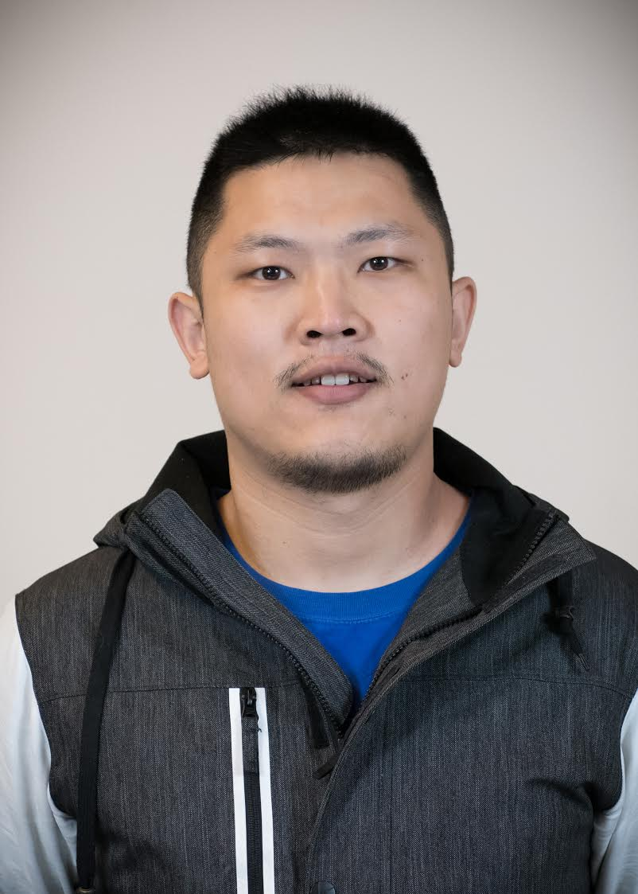

# Teaching Assistants

The teaching assistants for 431 this year are Bob Winkelman, Satyakam Mishra, Maher Kazimi, Zuxi (Terry) Cui and Xueyi (Julia) Zhang. They are the people answering `431-help at case dot edu`, and they are the people holding the bulk of our regular office hours. Most of them has been in your shoes - they've taken the course in the past, and they enjoyed it enough to come back for more. Many have volunteered their precious time and energy to help make the course happen, and we couldn't be more delighted to welcome you to the course.

To contact the TAs, email `431-help at case dot edu`, which is open all semester, starting on January 22.

## Office Hours for TAs

- To contact the TAs (and Dr. Love) at any time, email `431-help` at `case dot edu`.

Teaching Assistant Office Hours are held in either WG-56 (Computing Lab) or WG-67 (Student Lounge) on the ground floor of the Wood building in the School of Medicine, so be sure to look in both places if you need help. The weekly schedule is: 

Date | Time 
--------: | --------------
Mondays | 11:30 AM to 12:45 PM
Tuesdays | 11:30 AM to 12:45 PM, 2:30 PM to 3:45 PM
Wednesdays | 11:30 AM to 12:45 PM
Thursdays | 11:30 AM to 12:45 PM, 2:30 PM to 3:45 PM
Fridays | 11:30 AM to 12:45 PM

TA office hours will begin at 2:30 PM on Tuesday 2019-01-22. TA office hours are not held on University holidays, or during Spring Break, although 431-help remains open until the last project is completed in May.

This information is also available in the [Course Calendar](https://github.com/THOMASELOVE/2019-432/blob/master/calendar.md).

## Bob Winkelman

```{r Bobpic-fig, echo = FALSE, out.width = '33%'}
knitr::include_graphics("figures/Bob.jpg")
```

Bob Winkelman is a fourth year student in the M.D. program at the School of Medicine who is also enrolled in the M.S. program in Biostatistics. He received his undergraduate degree from Carnegie Mellon University where he majored in Chemical and Biomedical Engineering. Before coming to CWRU for medical school, Bob also worked for Epic, an electronic health record vendor, in Wisconsin. Bob took 431 and 432 two cycles ago and has appreciated how the skills he learned in those classes have helped him with his clinical outcomes research at Cleveland Clinic Center for Spine Health. Bob enjoys playing flag football, exercising, cooking, reading, and listening to podcasts. Bob is doing an internship this semester with Dr. Love at Better Health Partnership helping to incorporate social determinant information based on geography. Bob is Co-Lead TA for 432.

## Satyakam Mishra

```{r Satyakam-fig, echo = FALSE, out.width = '33%'}
knitr::include_graphics("figures/Satyakam.jpg")
```

Satyakam Mishra is in his second year in the M.S. program in Systems Biology and Bioinformatics. He completed his Bachelor's work in Biotechnology in India. He is primarily interested in the applications of statistical ideas in genetics research, and is currently analyzing conformational changes in protein structures with varying ligand-receptor combinations. The 431 and 432 coursework has turned out to be immensely useful in his thesis work. Satyakam's hobbies include cooking, reading and watching sports, and he enjoys outdoor activities, such as hiking and trekking. Satyakam is Co-Lead TA for 432.

## Maher Kazimi

```{r Maherpic-fig, echo = FALSE, out.width = '33%'}
knitr::include_graphics("figures/Maher.png")
```

Maher Kazimi is in his second year in the Masters of Public Health program's Population Health Research track. He is an international medical graduate from Jordan, and has practiced medicine in Jordan and Germany as a part of his internship in primary care medicine. He does research work in large data bases describing outcomes for transplant patients (with data from the United Network for Organ Sharing) and emergency department visits (from the Nationwide Emergency Department Sample.) He is also a part of the Health Data Matters team project at the Department of Population and Quantitative Health Sciences, and he is working with University Hospitals on his capstone project.

## Zuxi (Terry) Cui

```{r Terrypic-fig, echo = FALSE, out.width = '33%'}

```

Zuxi (Terry) Cui is in his third year in the Ph.D. program in Epidemiology & Biostatistics. Before that, Terry was a research associate at the University of Arizona Cancer Center doing Epi-genetic works related to skin cancer. His interests cover but not limited to missing data, longitudinal modeling, Epi-genetics, and imputation. He served as TA for 432 one year ago mainly dealing with statistical and coding issues. Terry wants to be a young Biostatistician & Genetic Epidemiologist
in a few years. He is also the father of a pup. and a kitten. and a fan of Asian classic and country music.

## Xueyi (Julia) Zhang

```{r Juliapic-fig, echo = FALSE, out.width = '33%'}
knitr::include_graphics("figures/Julia.png")
```

Julia is in her first year in the Ph.D. program in Epidemiology and Biostatistics, in the Department of Population and Quantitative Health Sciences. She holds an MS in Statistics from CWRU's School of Arts and Science. Julia's research interests include genetic epidemiology, statistical genetics, and machine learning. 

